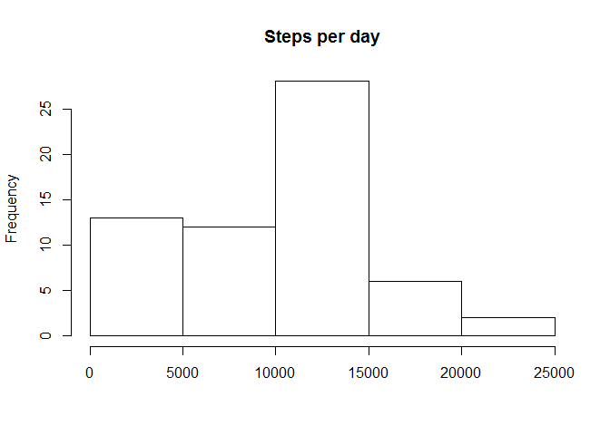
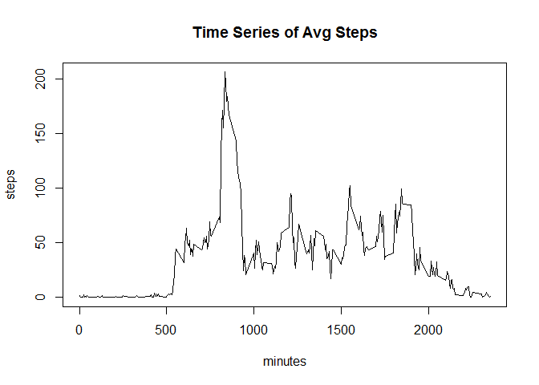
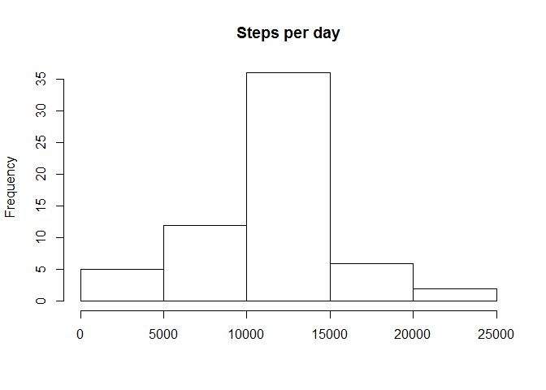
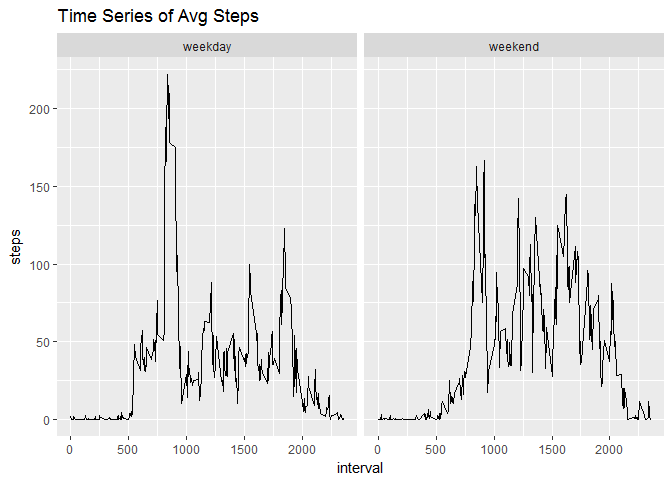

# Reproducible Research: Peer Assessment 1
Nicholas Shrefler  
March 19, 2017  


## Loading and preprocessing the data

```r
activity <- read.csv("activity.csv")
```


## What is mean total number of steps taken per day?

```r
steps_day <- tapply( activity$steps , activity$date, sum , na.rm = TRUE)
hist( steps_day , main = "Steps per day", xlab = "")
```

<!-- -->

```r
steps_day_mean <- mean( steps_day , na.rm = TRUE)
steps_day_median <- median( steps_day , na.rm = TRUE)
```
The mean steps per day is 9354.2295082 and the median steps per day is 10395.

## What is the average daily activity pattern?

```r
avgSteps_interval <- aggregate(steps ~ interval, data=activity, FUN = mean )
with( avgSteps_interval , plot( interval, steps, type = "l", main = "Time Series of Avg Steps", xlab="minutes" ))
```

<!-- -->

```r
interval_max <- avgSteps_interval[ which.max(avgSteps_interval$steps) , 1]
```
The peak interval is 835-840 minutes.

## Imputing missing values

```r
totalNA <- sum(is.na(activity))
activity_imputed <- activity
for( i in 1:nrow(activity)){
    if( is.na(activity_imputed[i,'steps']) == TRUE ){
        activity_imputed[i, 'steps'] <- mean( activity[ activity$interval == activity[i,"interval"],'steps'], na.rm = TRUE)
    }
}
steps_day_imputed <- tapply( activity_imputed$steps , activity_imputed$date, sum )
hist( steps_day_imputed , main = "Steps per day", xlab = "")
```

<!-- -->

```r
steps_day_imputed_mean <- mean( steps_day_imputed , na.rm = TRUE)
steps_day_imputed_median <- median( steps_day_imputed , na.rm = TRUE)
```
The mean steps per day is 9354.2295082 and the median steps per day is 10395 when using imputed data.  
The differences in the mean: 1411.959171 and in the median: 371.1886792 

## Are there differences in activity patterns between weekdays and weekends?

```r
activity_imputed$date <- as.Date( as.character(activity_imputed$date ))
activity_imputed$days <- weekdays( activity_imputed$date )
weekday <- c("Monday", "Tuesday", "wednesday", "Thursday", "Friday")
weekend <- c("Saturday", "Sunday")
for( i in 1:nrow(activity_imputed) ){
    if( activity_imputed[i,"days"] %in% weekday ){
        activity_imputed[i, "days"] <- "weekday"
    }
    else if(activity_imputed[i,"days"] %in% weekend ){
        activity_imputed[i,"days"] <- "weekend"
    }
    else{
        activity_imputed[i,"days"] <- NA
    }
}
activity_imputed$days <- as.factor(activity_imputed$days)
avgSteps_intervaldays <- aggregate(steps~interval + days, data = activity_imputed, FUN = mean)

library(ggplot2)
g <- ggplot( avgSteps_intervaldays, aes( interval, steps), stat = "sum")
g + geom_line() +
    facet_grid(.~days) +
    labs( title = "Time Series of Avg Steps")
```

<!-- -->


